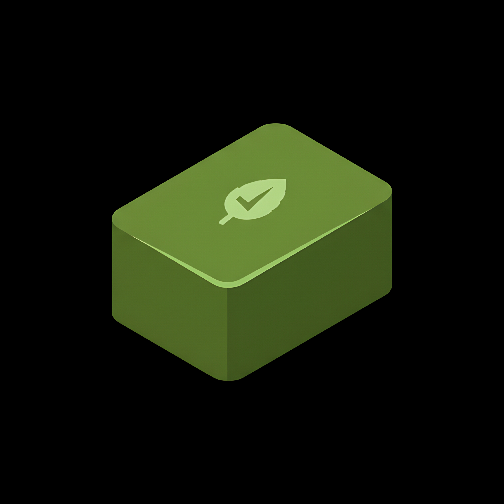
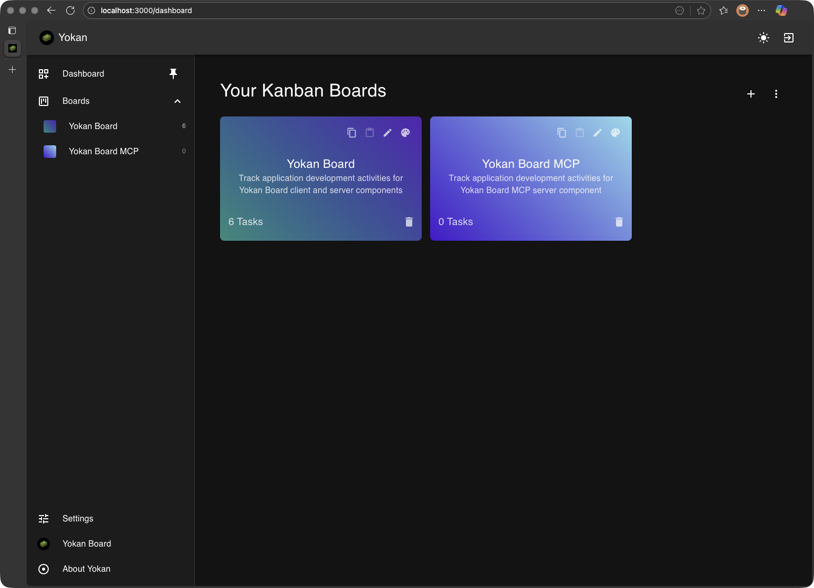
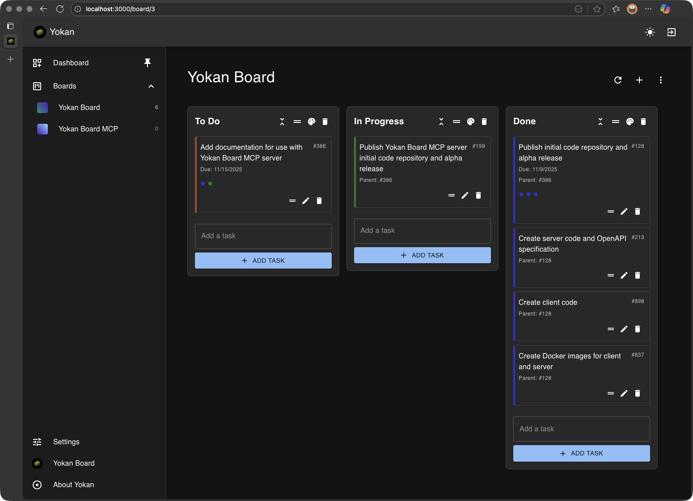
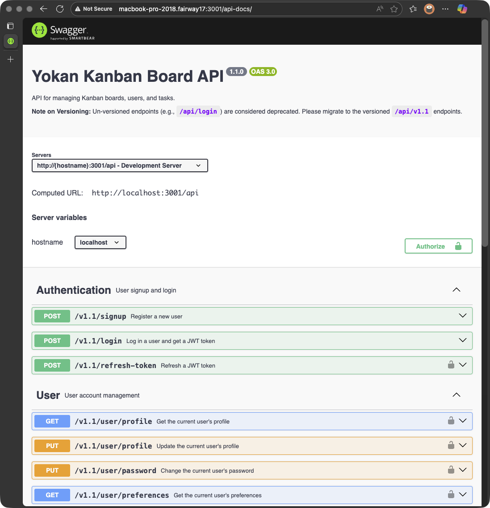

# Yokan - A Simple Self-Hosted Kanban Board

<p align="center">
  
</p>

Yokan, because yes, you can -- have a Kanban board that's simple, private, and truly yours.

Yokan (予感) is a clean, intuitive Kanban board application designed for simplicity and ease of self-hosting. Yokan provides a seamless experience for organizing tasks and managing projects without the complexity you would find with the alternatives. With [**Yokan Board MCP**](https://github.com/yokan-board/yokan-board-mcp), you can even use AI agents to interact with your Kanban boards.

恋の予感





## 🎯 Purpose

Yokan aims to provide a straightforward, privacy-focused alternative to complex online Kanban tools. Whether you're managing personal tasks, small team projects, or keeping track of ongoing work, Yokan offers a simple, reliable solution that you completely control.

## ✨ Features

- **Simple, Clean Interface**: Intuitive drag-and-drop Kanban board with minimal visual clutter
- **User Authentication**: Secure login and registration system with password protection
- **Personalized Boards**: Create multiple boards for different projects or contexts
- **Customizable Boards**:
    - Gradient color customization for boards, including copy/paste functionality and a color picker for fine-tuning
    - Inline editing of board names directly from the board page
- **Customizable Columns**:
    - Add, reorder, and delete columns
    - Minimize/maximize columns to focus on relevant tasks
    - Customize column appearance with a highlight color picker
- **Real-time Organization**: Drag and drop tasks between columns with immediate visual feedback
- **Dark/Light Mode**: Choose your preferred theme for comfortable viewing
- **Gravatar Integration**: Personalized avatars based on your email address
- **Nested Tasks Support**: Support for parent-child relationships and subtasks
- **Task Details**: Due dates and descriptions for tasks (supporting Markdown)
- **Data Export/Import**: Export boards in JSON or CSV formats for backup or migration
- **Automatic Session Management**: Your session is automatically renewed as long as you are active, preventing unexpected logouts during work
- **Self-Hosted Control**: Complete ownership of your data with no external dependencies
- **Responsive Design**: Works well on various screen sizes and devices
- **Persistent Sidebar**: A navigation sidebar that can be pinned/unpinned, displaying a list of boards with task counts and quick access to settings and user information
- **User Account Management**: A dedicated "Settings" page for managing your profile (display name, email, password) and preferences
- **About Page**: Displays application version, author, and license information
- **OpenAPI Specification**: Documented server API with Swagger UI
- **MCP Server**: Use [**Yokan Board MCP**](https://github.com/yokan-board/yokan-board-mcp) to use AI agents to interact with your Kanban boards

## 🌟 What Makes Yokan Different

While there are many Kanban solutions available, Yokan stands out in several key ways:

- **Extreme Simplicity**: No unnecessary features or complex workflows - just a clean Kanban board experience
- **Privacy First**: Your data never leaves your server; you have complete control and ownership
- **Easy Self-Hosting**: Minimal dependencies and straightforward setup with SQLite backend
- **Zero Vendor Lock-in**: Export your data anytime and switch hosting providers with ease
- **Lightweight**: Fast loading times and minimal resource usage compared to feature-heavy alternatives
- **Open Source**: Transparent development and the ability to customize to your needs

Yokan is built for users who want a Kanban solution without the bloat, privacy concerns, or recurring costs of popular alternatives.

## 🏛️ Server Architecture

The server-side codebase follows a modular and layered architecture:

- **`routes/`**: Defines API endpoints (`auth.js`, `boards.js`, `user.js`, `about.js`).
- **`controllers/`**: Contains core logic, handles requests, and interacts with models (`authController.js`, `boardController.js`, `userController.js`).
- **`models/`**: Encapsulates database interactions (CRUD operations).
- **`middleware/`**: Custom middleware for authentication, authorization, validation, and error handling.
- **`utils/`**: Utility functions and custom error classes.
- **`validation/`**: Defines validation schemas using `express-validator`.

## 🖥️ Client Architecture

The client-side codebase (React) is structured as follows:

- **`src/index.js`**: Application entry point.
- **`src/App.js`**: Main application component, handles routing and global contexts.
- **`src/pages/`**: Top-level page components for different views.
- **`src/components/`**: Reusable UI components.
- **`src/contexts/`**: Provides global state management (e.g., authentication, theme).
- **`src/services/`**: Manages API interactions with the backend.
- **`src/hooks/`**: Custom React hooks for specific functionalities.
- **`src/theme/`**: Defines Material-UI themes.
- **`src/utils/`**: General utility functions.

## 🚀 Quick Start

This section provides instructions for setting up and running Yokan on your local machine. You can choose between a local installation or using Docker Compose.

### Prerequisites

- Node.js (v18 or higher)
- npm (v8 or higher)
- Docker and Docker Compose (for Docker-based setup)

### Local Installation (Without Docker)

Follow these steps to run the client and server directly on your machine.

**1. Clone the Repository**

```bash
git clone https://github.com/yokan-board/yokan-board.git
cd yokan
```

**2. Install Dependencies**

```bash
# Install server dependencies
cd server
npm install

# Install client dependencies
cd ../client
npm install
```

**3. Set Up Environment Variables**

Create a `.env` file in the `server` directory:

```
DB_FILE=db.sqlite
INITIAL_USER_ID=user
INITIAL_USER_PASSWORD=password
JWT_SECRET=your_secret_key_here
PORT=3001
```

You can generate a strong JWT_SECRET by using the output of `openssl rand -base64 32`, for example.

**JWT Timeout Configuration:** The JWT token is configured to expire in 1 hour (`expiresIn: '1h'`) in `server/controllers/authController.js`. The client-side renewal logic (inactivity checks, refresh thresholds) is located in `client/src/contexts/AuthContext.js`.

Create a `.env` file in the `client` directory:

```bash
REACT_APP_SERVER_URL=http://localhost:3001/api/v1.1
```

**4. Start the Server**

```bash
cd ../server
npm start
```

The server will start on `http://localhost:3001`.
The interactive API documentation (Swagger UI) will be available at `http://localhost:3001/api-docs`.

**5. Start the Client**

In a new terminal window:

```bash
cd client
npm start
```

The client will start on `http://localhost:3000`.

**6. Access the Application**

Open your browser to `http://localhost:3000` and start using Yokan!

### Docker Compose Quickstart

For the fastest setup using Docker:

1.  **Ensure Docker is running.**
2.  **Build the images:** From the project root directory, run:
    ```bash
    # build server image
    cd server
    docker build -t yokanboard/yokan-server .

    # build client image
    cd client
    cp .env.example .env
    vi .env  # update values
    docker build -t yokanboard/yokan-client .
    ```
    This will build the `yokan-board/yokan-server` and `yokan-board/yokan-client` images.
3. **Start the services:** From the project root directory, run:
    ```bash
    cp docker-compose.yml.example docker-compose.yml
    vi docker-compose.yml  # update values
    docker compose up -d
    ```
4.  **Access the application:**
    - Frontend: `http://localhost:3000`
    - Backend API base URL: `http://localhost:3001/api/v1.1`
    - Backend API documentation (Swagger UI): `http://localhost:3001/api-docs`
5.  **Stop the services:**
    ```bash
    docker compose down
    ```

### Default Credentials

On first startup, a default user will be created:

- Username: `user`
- Password: `password`
- Email: `yokan.board@gmail.com`

**Important**: Change these credentials immediately after your first login.

## 🛠️ Development

To run the application in development mode with hot reloading:

1. **Start the backend server with nodemon (optional):**

    ```bash
    cd server
    # Install nodemon globally if you haven't already
    npm install -g nodemon
    # Run the server with auto-restart on changes
    nodemon index.js
    ```

2. **Start the frontend in development mode:**

    ```bash
    cd client
    npm start
    ```

3. **Run tests:**
    - Server tests: `cd server && npm test`
    - Client tests: `cd client && npm test`

4. **Reset the database (if needed):**

    ```bash
    cd server
    npm run reset-db
    ```

## 🐳 Docker Deployment

Yokan includes Dockerfiles for both client and server:

1. **Build and run server container:**

    ```bash
    cd server
    docker build -t yokanboard/yokan-server .
    docker run -p 3001:3001 -e NODE_ENV=production -e JWT_SECRET=your_secret_key_here yokanboard/yokan-server
    ```

2. **Build and run client container:**
    ```bash
    cd client
    docker build -t yokanboard/yokan-client .
    docker run -p 3000:3000 -e REACT_APP_SERVER_URL=http://localhost:3001/api/v1.1 yokanboard/yokan-client
    ```

## 🤝 Contributing

We welcome contributions to make Yokan better! Here's how you can help:

1. Fork the repository
2. Create a feature branch (`git checkout -b feature/amazing-feature`)
3. Make your changes
4. Add tests if applicable
5. Commit your changes (`git commit -m 'Add amazing feature'`)
6. Push to the branch (`git push origin feature/amazing-feature`)
7. Open a Pull Request

Please make sure to update tests as appropriate and follow the existing code style.

## 🏗️ Tech Stack

- **Frontend**: React v19.2.0, Material-UI v7.3.4, React Router v7.9.4, @dnd-kit, @mui/x-date-pickers, Prettier
- **Backend**: Node.js, Express.js v5.1.0
- **Database**: SQLite3
- **Authentication**: JWT with bcrypt hashing
- **Development**: The client-side is built using Create React App (which uses Webpack and Babel). The server-side uses `nodemon` for development. Both have ESLint and Prettier for code quality.
- **API Documentation**: Swagger UI with OpenAPI specification
- **Testing**: Jest for unit and integration tests

## 📄 Copyright

Yokan is created by: **Julian I. Kamil**

© Copyright 2025 Julian I. Kamil. All rights reserved.

## 📄 License

Yokan is available under a dual license:

- **AGPLv3**: Free to use, modify, and distribute under the terms of the GNU Affero General Public License Version 3 (see [LICENSE.AGPLv3](LICENSE.AGPLv3))
- **Commercial License**: Available for organizations that wish to use Yokan without AGPLv3's copyleft requirements (see [LICENSE.COMMERCIAL](LICENSE.COMMERCIAL))

For information on commercial use licensing, please email: yokan.board@gmail.com

## 🐛 Issues and Support

If you encounter any issues or have suggestions for improvements, please open an issue on the GitHub repository. Include as much detail as possible to help us resolve your concern quickly.

## 🙏 Acknowledgments

- Built with Create React App for rapid frontend development
- Powered by Express.js and SQLite for a lightweight backend solution
- Uses Material-UI for a consistent, accessible user interface
- Implements dnd-kit for smooth drag-and-drop functionality
- Integrates Swagger UI for API documentation
- Leverages Jest for comprehensive testing

---

Made with ❤️ for minimal, privacy-focused productivity
